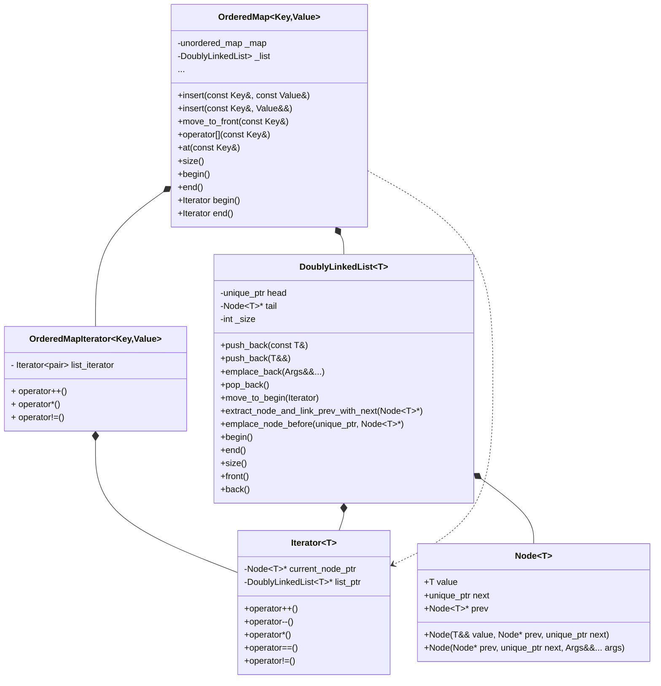

# Ordered Map Library

A C++ implementation of an ordered map data structure that maintains insertion order while providing O(1) key-value lookups.

## 🏆 Quality Metrics

- **Code Coverage**: 97.3% implementation coverage (271/277 lines)
- **Memory Safety**: Zero memory leaks verified by Valgrind
- **Test Suite**: 2,246 assertions across 195 test cases
- **Build Status**: [](https://github.com/mohameds-dev/ordered_map_lib/actions/workflows/cmake.yml)

## Table of Contents

- [Features](#features)
- [Usage](#usage)
- [Implementation Details](#implementation-details)
- [Class Diagram](#class-diagram)
- [Prerequisites](#prerequisites)
- [Project Structure](#project-structure)
- [Setting Up VS Code (or Cursor)](#setting-up-vs-code-or-cursor)
- [Formatting Code](#formatting-code)
- [Building and Running Tests](#building-and-running-tests)
- [Memory Leak Checks](#memory-leak-checks)
- [Code Coverage](#code-coverage)
- [GitHub Actions CI](#github-actions-ci)
- [Adding a New Test](#adding-a-new-test)
- [Future Improvements](#future-improvements)

## Features

- Maintains insertion order of key-value pairs
- O(1) key-value lookups using hash table
- O(1) insertion and deletion operations
- STL-like iterator interface
- Memory safe with smart pointers
- Exception handling for out-of-range access

## Usage

```cpp
#include "ordered_map.hpp"
#include <iostream>

int main() {

    // Create an ordered map
    OrderedMap<std::string, int> map;

    // Insert key-value pairs
    map.insert("apple", 1);
    map.insert("banana", 2);
    map.insert("cherry", 3);

    // Access values
    int value = map["apple"];  // Returns 1

    // Iterate in insertion order
    for (const auto& pair : map) {
        std::cout << pair.first << ": " << pair.second << std::endl;
    }

    return 0;
}
```

## Implementation Details

The implementation of `OrderedMap` uses a combination of:

- Doubly linked list for maintaining insertion order
- Smart pointers for memory management
- Hash table (std::unordered_map) for O(1) lookups
- STL-compatible iterator interface

## Class Diagram



## Prerequisites

- **CMake** (3.10+): `sudo apt install cmake`
- **Git**: `sudo apt install git`
- **C++ Compiler**: GCC 9.4.0+ (`sudo apt install g++`)
- **Clang-Format**: For code formatting (`sudo apt install clang-format`)
- **VS Code** or **Cursor**: Code editor with C++ support

Verify installations:

```bash
cmake --version
git --version
g++ --version
clang-format --version
```

## Project Structure

```
ordered_map/
├── .github/
│   └── workflows/
│       └── cmake.yml       # GitHub Actions workflow
├── CMakeLists.txt         # CMake build configuration
├── build.sh              # Script to build and test
├── .clang-format         # Code formatting rules
├── include/
│   ├── doubly_linked_list.hpp    # Doubly-linked list implementation
│   └── ordered_map.hpp          # Ordered map interface
├── src/
├── tests/
│   └── doubly_linked_list/      # Test files for doubly linked list
│       ├── front_and_back.cpp   # Tests for front/back operations
│       ├── iterator_tests.cpp   # Tests for iterator functionality
│       ├── pop_back_tests.cpp   # Tests for pop_back operations
│       ├── pop_front_tests.cpp  # Tests for pop_front operations
│       ├── push_back_tests.cpp  # Tests for push_back operations
│       └── push_front_tests.cpp # Tests for push_front operations
```

## Setting Up VS Code (or Cursor)

1. **Install Extensions**:

   - In VS Code/Cursor, go to Extensions (Ctrl+Shift+X).
   - Install:
     - **C/C++** (Microsoft): For IntelliSense and debugging.
     - **CMake Tools** (Microsoft): For CMake integration.

2. **Configure IntelliSense**:

   - Create `.vscode/settings.json` (or `.cursor/settings.json`):
     ```json
     {
       "C_Cpp.default.compileCommands": "${workspaceFolder}/build/compile_commands.json",
       "C_Cpp.clang_format_path": "/usr/bin/clang-format",
       "C_Cpp.formatting": "clangFormat",
       "editor.formatOnSave": true,
       "[cpp]": {
         "editor.defaultFormatter": "ms-vscode.cpptools"
       }
     }
     ```

3. **Open Project**:
   - Open the project folder in VS Code/Cursor.

## Formatting Code

- **Clang-Format**: Uses `.clang-format` for consistent style (Google-based).
- **Auto-Format**: Formats on save (see `editor.formatOnSave`).
- **Manual Format**:
  ```bash
  clang-format -i src/*.cpp include/*.hpp tests/*.cpp
  ```
- **Via build.sh**: Formats all `.cpp`/`.hpp` files before building.

## Building and Running Tests

1. **Build and Test**:

   ```bash
   chmod +x build.sh
   ./build.sh
   ```

   - Formats code, builds with CMake/make, and runs Catch2 tests.

2. **Output**:

   - Successful tests show:
     ```
     All tests passed (X assertions in Y test cases)
     ```

3. **Run Specific Tests**:
   ```bash
   cd build
   ./tests --tags [tag]
   ```

## Memory Leak Checks

This project is tested for memory leaks using Valgrind.  
Below is a sample output from running the full test suite under Valgrind:

```
$ valgrind --leak-check=full ./build/tests --rng-seed 0

==12798== Memcheck, a memory error detector
==12798== Copyright (C) 2002-2017, and GNU GPL'd, by Julian Seward et al.
==12798== Using Valgrind-3.15.0 and LibVEX; rerun with -h for copyright info
==12798== Command: ./build/tests --rng-seed 0
==12798==
Randomness seeded to: 0
===============================================================================
All tests passed (2246 assertions in 195 test cases)

==12798==
==12798== HEAP SUMMARY:
==12798==     in use at exit: 0 bytes in 0 blocks
==12798==   total heap usage: 1,528,976 allocs, 1,528,976 frees, 45,317,931 bytes allocated
==12798==
==12798== All heap blocks were freed -- no leaks are possible
==12798==
==12798== For lists of detected and suppressed errors, rerun with: -s
==12798== ERROR SUMMARY: 0 errors from 0 contexts (suppressed: 0 from 0)
```

## Code Coverage

This project includes comprehensive test coverage analysis using **LCOV**, which provides accurate coverage metrics for header-only libraries by distinguishing between implementation code and test code.

### Generate Coverage Report

From the build directory, run this script:

```bash
./create_and_run_coverage.sh
```

### Implementation Coverage Results

**Pure Implementation Coverage (excluding test code and system headers):**

- **doubly_linked_list.hpp**: **97.8%** of 185 lines covered
- **ordered_map.hpp**: **98.9%** of 91 lines covered

**Overall Project Coverage: 98.0%** (1464 of 1494 lines)

### Coverage Summary

This shows that:

- **97.8%** of the doubly linked list implementation is tested
- **98.9%** of the ordered map implementation is tested
- Only a few edge cases remain uncovered
- The test suite comprehensively exercises the core functionality

The HTML report provides line-by-line coverage details, showing exactly which implementation lines are covered by the test suite.

## GitHub Actions CI

- **Workflow**: `.github/workflows/cmake.yml` automates building and testing on push to `main` or pull requests to `main`.
- **Setup**:
  1. Push your repository to GitHub.
  2. Ensure `.github/workflows/cmake.yml` exists.
  3. CI runs `build.sh` on `ubuntu-latest`, formatting, building, and testing.
- **View Results**:
  - Check the "Actions" tab on GitHub for CI logs.

## Adding a New Test

1. **Choose the appropriate test file** in `tests/doubly_linked_list/` based on the functionality being tested:

   - `front_and_back.cpp` for front/back operations
   - `iterator_tests.cpp` for iterator functionality
   - `pop_back_tests.cpp` for pop_back operations
   - `pop_front_tests.cpp` for pop_front operations
   - `push_back_tests.cpp` for push_back operations
   - `push_front_tests.cpp` for push_front operations

2. **Add your test case**:

   ```cpp
   TEST_CASE("Your test description", "[tag]") {
       DoublyLinkedList<int> list;
       // Your test code here
       REQUIRE(/* your assertion */);
   }
   ```

3. **Rebuild and Test**:
   ```bash
   ./build.sh
   ```

## Future Features

- [ ] Add `move_to_front` and `move_to_back` operations in ordered_map to re-order entries (without affecting or copying the entry value)

- [ ] Add const iterators
- [ ] Add reverse iterators
- [ ] Add range-based operations
- [ ] Add performance benchmarks
- [ ] Add support for custom allocators
- [ ] Add std::move and copying semantics
- [ ] **DoublyLinkedList:** Add tests for copying & moving
- [ ] **DoublyLinkedList:** Add `erase` method to erase elements given their iterator
- [ ] **DoublyLinkedList:** Add pre and post decrement operators
- [ ] **DoublyLinkedList:** Test front(), back(), insertion and deletion functions for copying behavior
- [ ] **OrderedMap:** Add support for initializing map with
- [ ] **OrderedMap:** Add support for custom hash functions
- [ ] **OrderedMap:** Add `erase` method to erase elements given their iterator or key
- [ ] Test for memory leaks
